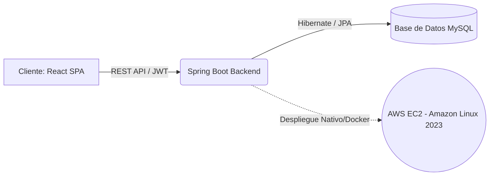
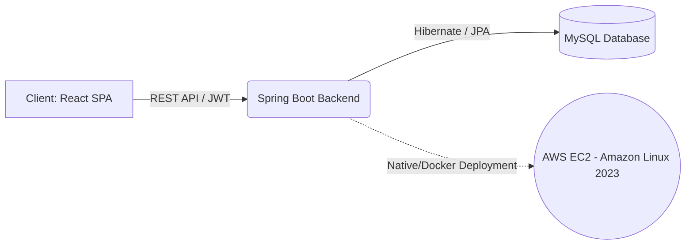

# 📦 MyLogist - Smart Inventory & Sales Management

  
  
  
  
  
  

 

> **🧪 Sandbox Demo:** *(Próximamente: Credenciales de prueba para explorar el sistema con datos pre-cargados).*

---

*(English version below | Versión en español abajo)*

## 🇪🇸 Versión en Español

Transformando la gestión tradicional en una solución en la nube escalable y de alto rendimiento.

MyLogist es una plataforma SaaS integral construida para resolver cuellos de botella logísticos del mundo real. Maneja control de inventario en tiempo real, gestión segura de personal basada en roles y seguimiento de ventas, todo bajo una arquitectura desacoplada y lista para la nube.

### 🏗️ Arquitectura del Sistema

### 🎯 Dimensión del Proyecto
MyLogist no es un simple CRUD; es una herramienta empresarial completa diseñada para escalar:
- **Experiencia Multiplataforma:** Interfaz 100% responsive. Gestioná tu stock, auditá movimientos y revisá ventas desde un smartphone con la misma potencia que en una PC.
- **Ciclo de Caja Profesional:** Control de apertura y cierre de turnos con validación física, generación automática de tickets de venta y analítica dinámica de evolución mensual.
- **Trazabilidad Total:** Historial de movimientos inalterable para garantizar la absoluta transparencia del negocio.

### 🧠 Desafíos Técnicos y Seguridad Avanzada (Backend Highlight)
Para garantizar una calidad a nivel Enterprise, el backend fue diseñado con un enfoque estricto en la seguridad y el rendimiento:

1. **Seguridad Stateless y CORS Estricto:** La API está protegida por un `JwtAuthenticationFilter` personalizado. Las políticas de CORS están explícitamente restringidas a dominios de producción y redes locales específicas, rechazando peticiones de orígenes no confiables.
2. **Evaluador de Permisos Custom (RBAC Avanzado):** En lugar de depender de roles básicos, se implementó un componente `PermisosEvaluator` inyectado en el contexto de Spring. Esto permite una seguridad granular a nivel de método, evaluando si un usuario tiene permisos específicos de Inventario o Ventas, manteniendo una jerarquía absoluta para los perfiles `ROLE_SUPERADMIN`.
3. **Dashboards de Carga Instantánea:** Se evitó el problema de "over-fetching" implementando estrictos Data Transfer Objects (DTOs). El frontend solo recibe el payload exacto necesario, optimizando las consultas SQL y renderizando en milisegundos.
4. **Tuning de Infraestructura Cloud:** Desplegado en AWS utilizando Amazon Linux 2023. En lugar de depender de un entorno 100% Dockerizado para todo, tareas específicas fueron optimizadas para correr de forma nativa, demostrando un profundo entendimiento de la configuración a nivel de sistema operativo.

### 🚀 Despliegue y Pruebas Locales

**Prerrequisitos:** Java 17, Node.js y MySQL.

1. **Clonar el repositorio:**
   `git clone https://github.com/FACUU04/Web_Inventario.git`
2. **Configurar Base de Datos:**
   Crear una base de datos MySQL llamada `mylogist_db` y configurar las credenciales en `application.properties`.
3. **Levantar el Backend (Spring Boot):**
   `cd backend` -> `mvn clean install` -> `mvn spring-boot:run`
4. **Levantar el Frontend (React):**
   `cd frontend` -> `npm install` -> `npm run dev`

---

## 🇬🇧 English Version

Transforming traditional management into a high-performance, scalable cloud solution.

MyLogist is a comprehensive SaaS platform built to solve real-world logistical bottlenecks. It handles real-time inventory control, secure role-based staff management, and sales tracking, all wrapped in a decoupled, cloud-ready architecture.

### 🏗️ System Architecture

### 🎯 Scope & Dimension
MyLogist isn't just a CRUD app; it's a full-fledged business tool designed for scale:
- **Multi-Platform Experience:** 100% responsive interface. Manage stock, audit movements, and review sales from a smartphone with the same power as a desktop.
- **Professional Cash Cycle:** Controls shift openings/closings with physical validation, automatic generation of professional sales receipts, and monthly dynamic sales analytics.
- **Traceability:** Immutable movement history to ensure complete business transparency.

### 🧠 Technical Challenges & Advanced Security (Backend Highlight)
To ensure enterprise-level quality, the backend was designed with a strict focus on security and performance:

1. **Stateless Security & Strict CORS:** The API is secured by a custom `JwtAuthenticationFilter`. CORS policies are explicitly restricted to production domains and specific local networks, rejecting requests from untrusted origins.
2. **Custom Permission Evaluator (Advanced RBAC):** Instead of relying on basic roles, a custom `PermisosEvaluator` component was implemented. This allows granular method-level security, evaluating specific module permissions (Inventory vs. Sales) while maintaining absolute hierarchy for `ROLE_SUPERADMIN` profiles.
3. **Lightning-Fast Dashboards:** Avoided the "over-fetching" problem by implementing strict Data Transfer Objects (DTOs). The frontend only receives the exact payload needed, optimizing SQL queries and rendering in milliseconds.
4. **Cloud Infrastructure Tuning:** Deployed on AWS utilizing Amazon Linux 2023. Rather than defaulting to a 100% Dockerized environment for everything, specific tasks were optimized to run natively, demonstrating a deep understanding of OS-level configuration.

### 🚀 Getting Started (Local Setup)

**Prerequisites:** Java 17, Node.js, and MySQL.

1. **Clone the repository:**
   `git clone https://github.com/FACUU04/Web_Inventario.git`
2. **Database Setup:**
   Create a MySQL database named `mylogist_db` and configure your credentials in `application.properties`.
3. **Run Backend (Spring Boot):**
   `cd backend` -> `mvn clean install` -> `mvn spring-boot:run`
4. **Run Frontend (React):**
   `cd frontend` -> `npm install` -> `npm run dev`
